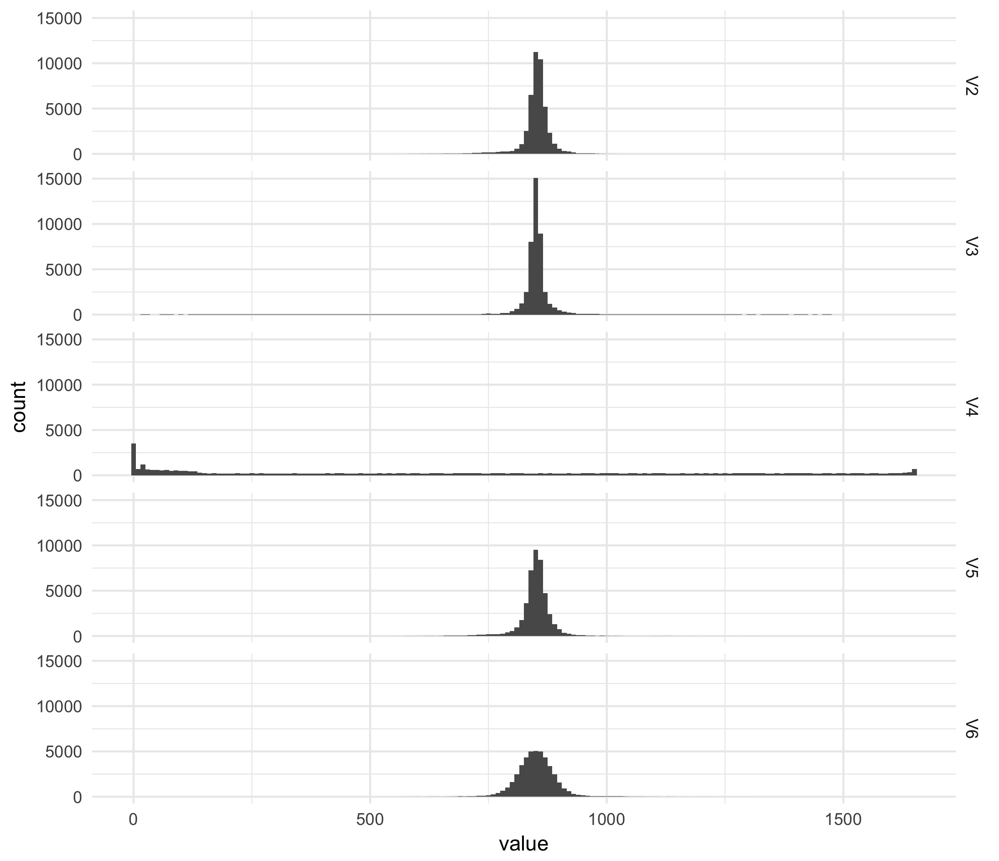

# Rainbow muse

### `osc-monitor.py`
Reads an input OSC stream from e.g. a `Muse Monitor` mobile app to put out the eeg/accelerometer values. Requires `python-osc`

#### Raw data collected
The `osc-monitor.py` was run to collect ~ 60k EEG recordings. Data was saved in `collected_eeg_data.tsv` and subsequently plotted with `plot_histogram.R`. The resulting figure is in `histogram.png`

