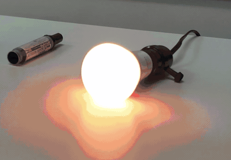

# Rainbow muse

### `osc-monitor.py`
Reads an input OSC stream from e.g. a `Muse Monitor` mobile app to put out the eeg recordings as well as blink/clenching events.

Events are used to light up Philips Hue lamps. Disruptive events like blinks & clenches lead to a rapid color change (aka party mode), resting recordings lead to slow color waves. 

Requires `python-osc`, `phue` & `arrow` libraries.

#### Raw data that can be collected: EEG
The `osc-monitor.py` was run to collect ~ 60k EEG recordings. Data was saved in `collected_eeg_data.tsv` and subsequently plotted with `plot_histogram.R`. The resulting figure is in `histogram.png`

#### Lighting up the Philips Hue
The connection to the Philips Hue is managed through `phue`. Each EEG reading is used to randomly set the color & brightness of the Hue lamp.

[See an example on Twitter](https://twitter.com/gedankenstuecke/status/1007557614773813248).
